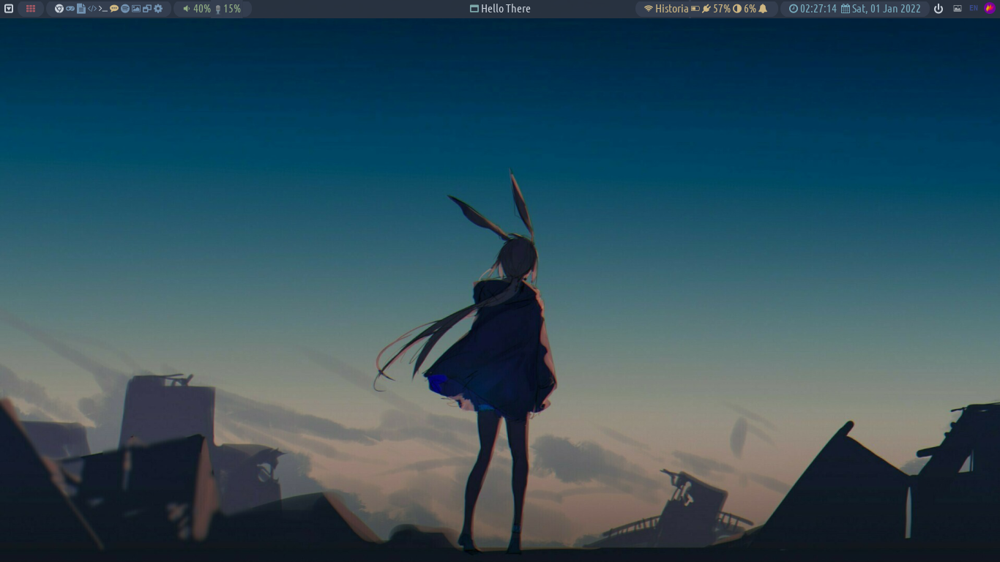

# custom-desktop

My script file that i use to make a usable desktop of linux distro without Desktop Environment (for now i planned to use it on Debian 11)

Using [bspwm](https://github.com/baskerville/bspwm) as window manager, [sxhkd](https://github.com/baskerville/sxhkd) as hotkey daemon, [polybar](https://github.com/polybar/polybar) as panel, and [rofi](https://github.com/davatorium/rofi) as application launcher.

This script was inspired by [this](https://github.com/christitustech/debian-titus).

